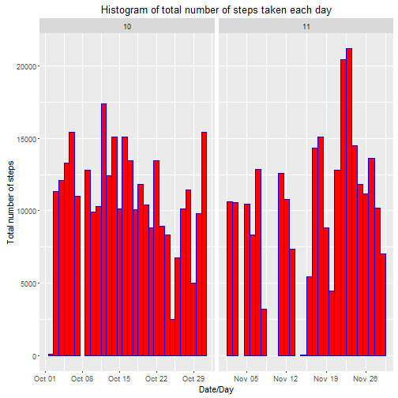
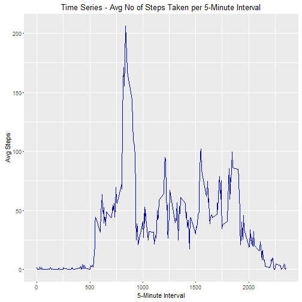
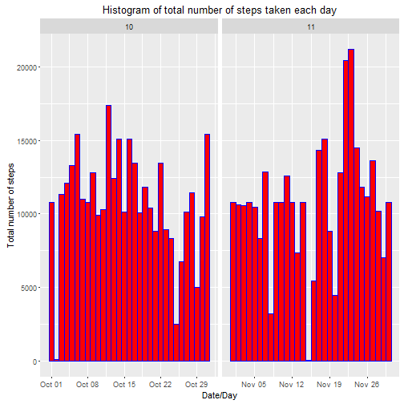
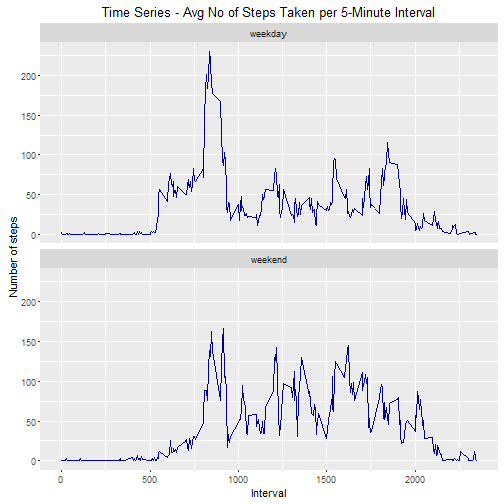

Reproducible Research: Week1 - Peer Assessment 1
=======================================================
Created by Chetan Mohite on Friday, January 08, 2016

### Required Settings & Packages Installation


```r
# Making code visible
echo=TRUE 

# Please ensure below packages before running this script
# downlaoder, dplyr, ggplot2, knitr, htmltools, caTools, rmarkdown
```


```r
# Load downlaoder package
library(downloader)

# Load package
library(dplyr)

# Load ggplot2 package
library(ggplot2)

# Load other required packages
library(knitr)
library(htmltools)
library(caTools)
library(rmarkdown)
```


### Loading and preprocessing the data

Show any code that is needed to

* Load the data 

```r
## 1. Code Below for reading in the dataset and/or processing the data

# Acivity Monitoring Data URL
url <- "https://d396qusza40orc.cloudfront.net/repdata%2Fdata%2Factivity.zip"

# Dowload acitivity monitoring data file into data directory
if (!dir.exists("data")) {
        dir.create("data")
}
download(url, dest=".\\data\\activity.zip", mode="wb") 
unzip (".\\data\\activity.zip", exdir = ".//data")

# Load data into R from .csv
activity <- read.csv(".\\data\\activity.csv", header=TRUE)
```


```r
# Summaries
names(activity)
```

```
## [1] "steps"    "date"     "interval"
```

```r
dim(activity)
```

```
## [1] 17568     3
```

```r
head(activity)
```

```
##   steps       date interval
## 1    NA 2012-10-01        0
## 2    NA 2012-10-01        5
## 3    NA 2012-10-01       10
## 4    NA 2012-10-01       15
## 5    NA 2012-10-01       20
## 6    NA 2012-10-01       25
```

```r
str(activity)
```

```
## 'data.frame':	17568 obs. of  3 variables:
##  $ steps   : int  NA NA NA NA NA NA NA NA NA NA ...
##  $ date    : Factor w/ 61 levels "2012-10-01","2012-10-02",..: 1 1 1 1 1 1 1 1 1 1 ...
##  $ interval: int  0 5 10 15 20 25 30 35 40 45 ...
```

* Process/Tranform the data 

```r
# Add a new variable datetime created using date & interval variables
activity$datetime <- as.POSIXct(paste(activity$date, 
                                      sprintf("%04.0f", activity$interval)), 
                                format="%Y-%m-%d %H%M")

# Transform date variable from factor to date
activity$date <- as.Date(activity$date)

# Add a new variable month; create it from date values.
activity$month <- as.numeric(format(activity$date, "%m"))
```

### What is mean total number of steps taken per day?
For this part of the assignment, you can ignore the missing values in the dataset.

* Calculate the total number of steps taken per day.

```r
## 2. Histogram of the total number of steps taken each day

# Total No of Steps taken per day
by_date <- group_by(activity, date, month)
sum_by_date <- summarise(by_date, totalsteps=sum(steps))
```

* Plot the data 

```r
# Plot Histogram of the total number of steps taken each day
ggplot(sum_by_date, aes(date, totalsteps)) + 
        geom_bar(stat = "identity", colour = "blue", fill="red",width = 1) + 
        facet_grid(. ~ month, scales = "free") + 
        labs(title = "Histogram of total number of steps taken each day", 
             x = "Date/Day", y = "Total number of steps")
```

```
## Warning: Removed 8 rows containing missing values (position_stack).
```



* Calculate and report the mean and median of the total number of steps taken per day

```r
## 3. Mean and median number of steps taken each day
# Mean
mean(sum_by_date$totalsteps, na.rm=TRUE)
```

```
## [1] 10766.19
```

```r
# Median
median(sum_by_date$totalsteps, na.rm=TRUE)
```

```
## [1] 10765
```

### What is the average daily activity pattern?

* Calculate the average activity per 5-minute interval

```r
## 4. Time series plot of the average number of steps taken

# Avg No of Steps taken per 5 minute interval
by_interval <- group_by(activity, interval)
avg_by_interval <- summarise(by_interval, avgsteps=mean(steps, na.rm=TRUE))
```

* Plot the time series

```r
# Plot Time Series of the avg no of steps taken per 5-minute interval
ggplot(avg_by_interval, aes(interval, avgsteps)) + 
        geom_line(colour = "darkblue") + 
        labs(title = "Time Series - Avg No of Steps Taken per 5-Minute Interval"
             , x = "5-Minute Interval", y = "Avg Steps")
```



* 5-minute interval, on avrage across all the days in the dataset, that contains max number of stpes

```r
## 5. The 5-minute interval that, on average, contains the maximum number of 
# steps
maxavgstpes <- max(avg_by_interval$avgsteps)
avg_by_interval[avg_by_interval$avgsteps==maxavgstpes, ]$interval
```

```
## [1] 835
```

### Imputing missing values

* Calculate and report the total number of missing values in the dataset (i.e. the total number of rows with NAs)

```r
## 6. Code to describe and show a strategy for imputing missing data

# Count of Observations/records with missing steps values in the dataset
count(activity[is.na(activity$steps),])
```

```
## Source: local data frame [1 x 1]
## 
##       n
##   (int)
## 1  2304
```

* Devise a strategy for filling in all of the missing values in the dataset. 

My stratgey is to use average of the same 5 minute interval across all days in the dataset

* Create a new dataset that is equal to the original dataset but with the missing data filled in

```r
# Create a new dataset from original dataset but Imput missing values with avg 
# of that 5-minute interval
activity_no_NAs <- activity
for (i in 1:nrow(activity_no_NAs)) {
        if (is.na(activity_no_NAs[i, ]$steps)) {
                affected_interval <- activity_no_NAs[i, ]$interval
                activity_no_NAs[i, ]$steps <- 
                        avg_by_interval[avg_by_interval$interval==
                                                affected_interval, ]$avgsteps
        }
}
```

* Plot the histogram 

```r
## 7. Histogram of the total number of steps taken each day after missing values
## are imputed

# Total No of Steps taken per day
by_date <- group_by(activity_no_NAs, date, month)
sum_by_date <- summarise(by_date, totalsteps=sum(steps))

# Plot Histogram of the total number of steps taken each day
ggplot(sum_by_date, aes(date, totalsteps)) + 
        geom_bar(stat = "identity", colour = "blue", fill="red",width = 1) + 
        facet_grid(. ~ month, scales = "free") + 
        labs(title = "Histogram of total number of steps taken each day", 
             x = "Date/Day", y = "Total number of steps")
```



* Mean & Median for 

```r
# Mean
mean(sum_by_date$totalsteps, na.rm=TRUE) # [1] 10766.19
```

```
## [1] 10766.19
```

```r
# Median
median(sum_by_date$totalsteps, na.rm=TRUE) # [1] 10766.19
```

```
## [1] 10766.19
```

```r
## 
```

The mean value is not changing. The medium value here is changed slightly and it is same as the mean.

### Are there differences in activity patterns between weekdays and weekends?

* Create a new factor variable in the dataset with two levels - "weekday" and "weekend" indicating whether a given date is a weekday or weekend day

```r
## 8. Panel plot comparing the average number of steps taken per 5-minute 
## interval across weekdays and weekends

# Add new variables (day & week) to imputted dataset
activity_no_NAs$day <- weekdays(activity_no_NAs$date)
activity_no_NAs$week <- "weekday"
activity_no_NAs[activity_no_NAs$day == "Saturday" | activity_no_NAs$day == 
                        'Sunday',]$week = "weekend"

# Avg No of Steps taken per 5 minute interval
by_week <- group_by(activity_no_NAs, week, interval)
avg_by_week <- summarise(by_week, avgsteps=mean(steps, na.rm=TRUE))
```

* Plot the Time Series

```r
# Plot Time Series of the avg no of steps taken per 5-minute interval
ggplot(avg_by_week, aes(interval, avgsteps)) + 
     geom_line(colour = "darkblue") + 
     facet_wrap(~ week, ncol=1, nrow=2) + 
     labs(title = "Time Series - Avg No of Steps Taken per 5-Minute Interval", 
          x = "Interval", y = "Number of steps")
```




